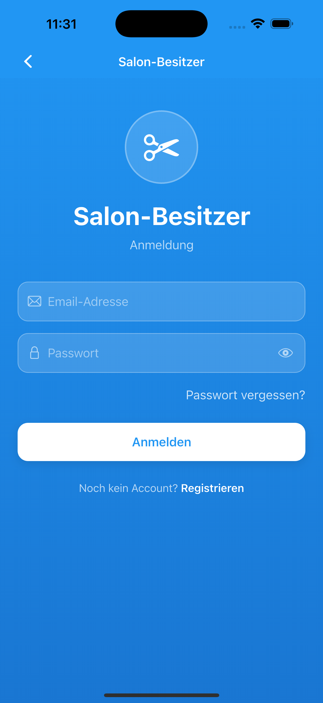

# Styling4You Portfolio  

## Überblick  
Dies ist mein persönliches Portfolio für die App Styling4You, eine Friseur-App zur Terminverwaltung und Servicebuchung.  

## Kernkompetenzen  
- **Mobile-Entwicklung mit Flutter**  
- **Saubere Architektur & modulare Code‑Strukturen**  
- **Rollen‑ & Rechteverwaltung**  
- **Nutzerzentrierte Produktentwicklung**  
- **Praktische Problemlösung**  

## Beispielprojekt: Styling4You  
Styling4You ist eine digitale Salon‑ und Terminverwaltungs‑App für Beauty‑Studios und Salons. Sie vereinfacht Buchungen, Servicekataloge und die Kundenkommunikation.  

### Problem  
Salons arbeiten häufig mit manuellen Terminbüchern und verstreuten Kommunikationskanälen. Das führt zu verpassten Buchungen, ineffizienter Planung und einer schlechten Kundenerfahrung.  

### Lösung  
Styling4You bietet eine einheitliche Plattform, auf der Kunden Dienstleistungen durchsuchen, Termine buchen und Bestätigungen erhalten, während Salonbesitzer ihren Kalender, ihre Services und die Verfügbarkeit des Personals verwalten.  

### Hauptfunktionen  
- **Servicekatalog:** Benutzerfreundliches Durchsuchen von Dienstleistungen nach Kategorie.  
- **Terminbuchung:** Intuitive Buchungsfunktionen mit Echtzeit‑Verfügbarkeit.  
- **Benachrichtigungen:** Automatische Erinnerungen und Bestätigungen per Push‑Mitteilung oder E‑Mail.  
- **Rollen & Rechte:** Verschiedene Benutzerrollen für Administratoren, Angestellte und Kunden.  
- **Analytics:** Einfache Auswertungen zu Buchungen und Umsatz (geplant).  

## Screenshots  
Die folgenden Bilder zeigen ausgewählte Bereiche der App. Mit der HTML‑Einbettung werden die Screenshots verkleinert dargestellt und nebeneinander angeordnet, um eine bessere Übersichtlichkeit zu gewährleisten.  

  
  
  
  

  

  
  
  

  

## Nutzung  
Um die App zu testen, siehe die bereitgestellten Screenshots für einen ersten Eindruck. Der Quellcode bleibt privat, aber ich freue mich, über meine Arbeit und Projekte zu sprechen.
