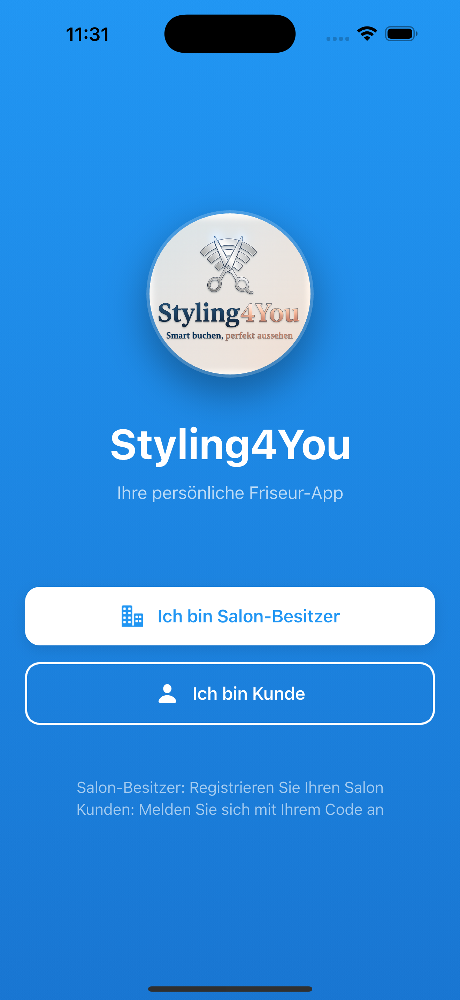
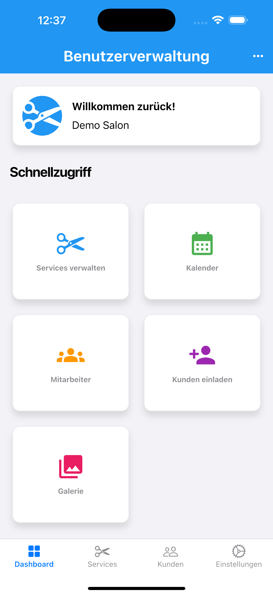
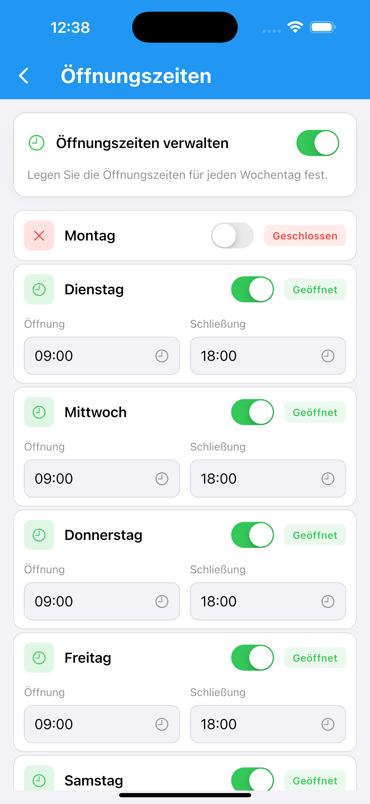
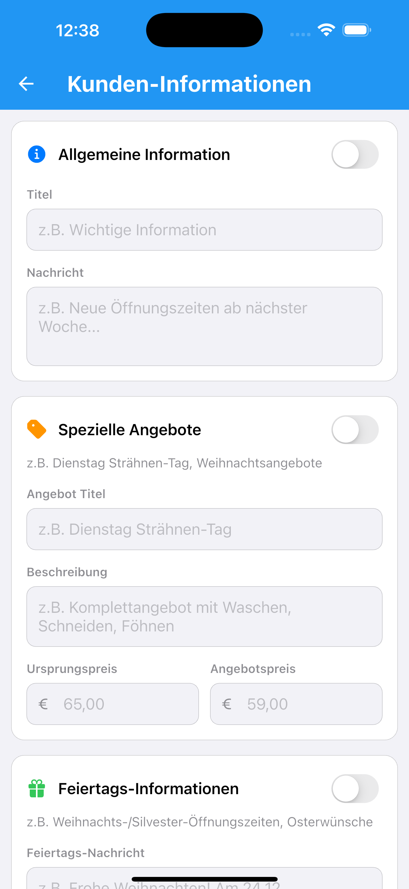
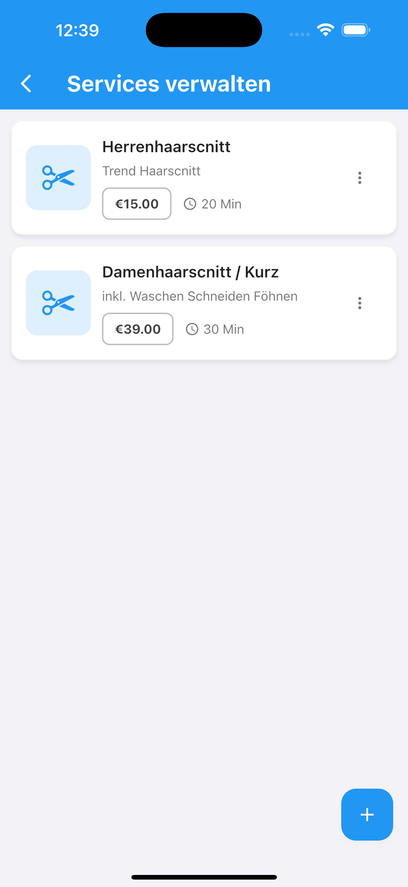

# Styling4You Portfolio
## Überblick
Dies ist mein persönliches Portfolio für die App Styling4You, eine Friseur-App zur Terminverwaltung und Servicebuchung.

## Kernkompetenzen
- **Mobile-Entwicklung mit Flutter**
- **Saubere Architektur & modulare Code Strukturen**
- **Rollen & Rechteverwaltung**
- **Nutzerzentrierte Produktentwicklung**
- **Praktische Problemlösung**

## Beispielprojekt: Styling4You
Styling4You ist eine digitale Salon und Terminverwaltungs-App für Beauty-Studios und Salons. Sie vereinfacht Buchungen, Servicekataloge und die Kundenkommunikation.

## Problem
Salons arbeiten häufig mit manuellen Terminbüchern und verstreuten Kommunikationskanälen. Das führt zu verpassten Buchungen, ineffizienter Planung und einer schlechten Kundenerfahrung.

### Lösung
Styling4You bietet eine einheitliche Plattform, auf der Kunden Dienstleistungen durchsuchen, Termine buchen und Bestätigungen erhalten, während Salonbesitzer ihren Kalender, ihre Services und die Verfügbarkeit des Personals verwalten.

### Hauptfunktionen
- **Servicekatalog:** Benutzerfreundliches Durchsuchen von Dienstleistungen nach Kategorie.
- **Terminbuchung:** Intuitive Buchungsfunktionen mit Kalenderübersicht.
- **Benachrichtigungen:** Automatische Erinnerungen und Bestätigungen per Push-Mitteilung oder E-Mail.
- **Rollen & Rechte:** Verschiedene Benutzerrollen für Salonbesitzer, Angestellte und Kunden.
- **Analytics:** Einfache Auswertungen zu Buchungen und Trends.
- **Echtzeit -Synchronisierung:** Alle Änderungen, die der Salon-Benutzer in der App macht – etwa Öffnungszeiten, Serviceverwaltung, Kundeninformationen oder Galerie-Bilder – werden unmittelbar aktualisiert, sodass Kunden immer auf dem neuesten Stand bleiben.

### Screenshots – Salon- & Kundenansicht
Die folgenden Bilder zeigen ausgewählte Bereiche der App. Mit der HTML -Einbettung werden die Screenshots verkleinert dargestellt und nebeneinander angeordnet, um eine bessere Übersichtlichkeit zu gewährleisten.

Um die App zu testen, sieh dir die bereitgestellten Screenshots für einen ersten Eindruck. Der Quellcode bleibt privat, aber ich freue mich, über meine Arbeit und Projekte zu sprechen.  
Bei Interesse können Sie mich gern über GitHub oder per E-Mail kontaktieren.  
