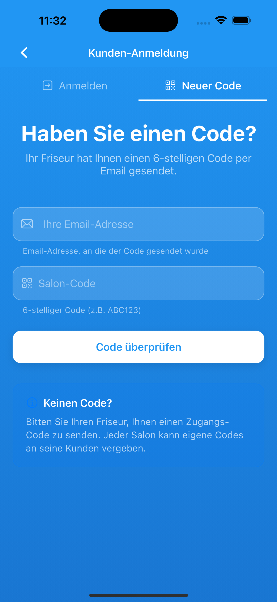

# Styling4You  
**Digitale Salon- & Terminmanagement-App**  
  
---  
  
## Projektüberblick  
**Styling4You** ist eine mobile Anwendung für Friseursalons und Beauty-Studios zur digitalen Verwaltung von Terminen, Services und Kundenkommunikation.  
Ziel ist es, manuelle Prozesse zu reduzieren und sowohl für Betriebe als auch für Kunden eine klare, effiziente Lösung bereitzustellen.  
  
> Der Quellcode dieses Projekts ist bewusst **privat**.  
> Diese Seite beschreibt **Konzept, Architektur und Mehrwert**.  
  
## Screenshots

  

  

  

 
---  
  
## Ausgangslage / Problemstellung  
Viele Salons arbeiten weiterhin mit:  
- telefonischer Terminvergabe  
- manueller Planung (Kalender, Zettel, WhatsApp)  
- fehlender Transparenz für Kunden  
- hohem Zeitaufwand für Organisation  
  
Das führt zu:  
- unnötiger Arbeitsbelastung  
- Terminfehlern  
- eingeschränkter Skalierbarkeit  
  
---  
  
## Zielsetzung  
Entwicklung einer **zentralen, mobilen Lösung**, die:  
- Terminverwaltung vereinfacht  
- Kundenkommunikation automatisiert  
- für Salons sofort nutzbar ist  
- für Endkunden intuitiv bleibt  
  
---  
  
## Lösungskonzept  
Styling4You bündelt alle relevanten Abläufe in einer App:  
  
- Digitale Terminbuchung  
- Service- & Zeitlogik pro Salon  
- Rollenbasiertes System (Salon / Kunde)  
- Direkte Informations- & Terminbenachrichtigungen  
  
---  
  
## Zentrale Funktionen  
  
### Salon-Seite  
- Salon-Profil mit Logo & Beschreibung  
- Individuelle Service-Liste inkl. Dauer  
- Terminübersicht & Statusverwaltung  
- Push-Benachrichtigungen an Kunden  
- Foto-Galerie zur Präsentation  
  
### Kunden-Seite  
- Einfache Terminbuchung  
- Übersicht über eigene Termine  
- Automatische Benachrichtigungen  
- Transparente Service-Informationen  
  
---  
  
## Benutzerrollen & Zugriff  
- **Saloninhaber**  
  - Verwaltung von Services, Terminen & Inhalten  
- **Kunde**  
  - Buchung & Einsicht eigener Termine  
  
Zugriffe sind klar getrennt und rollenbasiert aufgebaut.  
  
---  
  
## Mehrwert  
  
### Für Salons  
- Zeitersparnis durch weniger Telefonate  
- Strukturierte Planung  
- Professioneller Außenauftritt  
- Skalierbar für wachsende Betriebe  
  
### Für Kunden  
- Flexible Terminbuchung  
- Klare Übersicht  
- Direkte Kommunikation  
  
---  
  
## Technischer Ansatz (High Level)  
- **Flutter** – plattformübergreifend (iOS & Android)  
- **Firebase**  
  - Authentifizierung  
  - Datenbank (strukturierte Salon- & Termindaten)  
  - Storage für Medien  
- **Rollenbasierte Architektur**  
- Fokus auf wartbaren, modularen Code  
  
---  
  
## Aktueller Status  
- Konzept & Kernfunktionen definiert  
- UI/UX-Struktur ausgearbeitet  
- Architektur & Rollenmodell festgelegt  
  
---  
  
## Geplante Weiterentwicklung  
- Erweiterte Statistiken für Salons  
- Mehrsprachigkeit  
- Erweiterte Benachrichtigungslogik  
- Optimierung für größere Salonketten  
  
---  
  
## Lernergebnisse & Fokus  
Dieses Projekt zeigt:  
- strukturiertes Produktdenken  
- saubere Trennung von Rollen & Verantwortlichkeiten  
- Fokus auf reale Business-Probleme  
- nachhaltige Architektur statt kurzfristiger Lösungen  
  
---  
  
## Einsatz im Bewerbungsprozess  
Dieses Projekt dient als:  
- Gesprächsgrundlage in Interviews  
- Beispiel für selbstständige Projektumsetzung  
- Nachweis für Architektur- & Produktverständnis 
